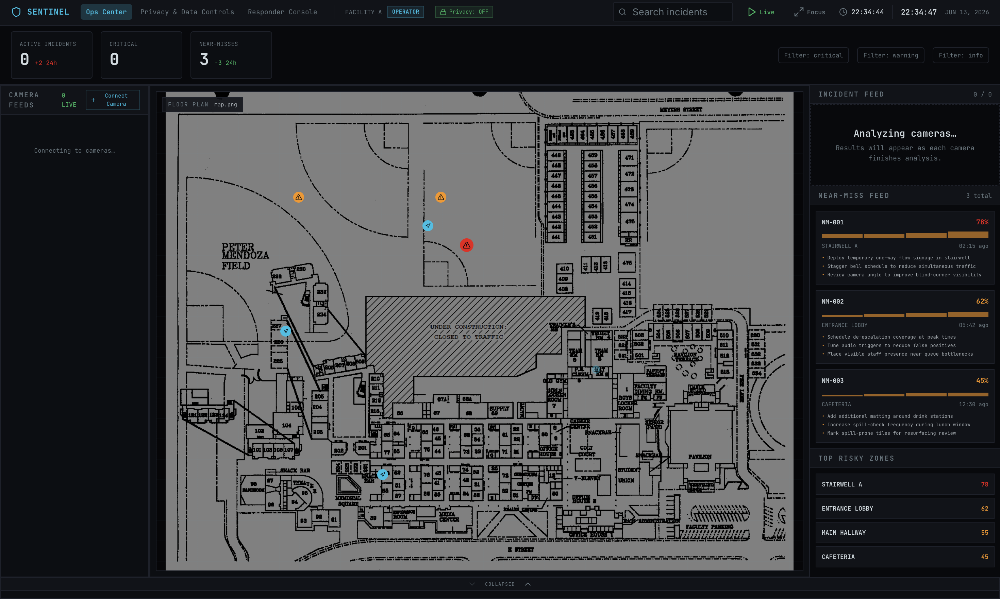

<div align="center">

# Sentinel

Sentinel is an AI-powered security and threat detection platform designed to identify dangerous situations before they escalate. By combining computer vision, facial analysis, and large language models, Sentinel helps security teams monitor incidents, assess risk levels, and respond faster during emergencies.

</div>

<div align="center">



</div>

---

## Features

* AI-powered threat assessment
* Real-time video analysis
* YOLOv8 object detection
* Facial and emotion recognition
* Incident detection and alerting
* Operations dashboard for monitoring events
* Mobile responder application
* YouTube and video file analysis
* Live camera management
* Risk scoring and threat classification
* Interactive maps and responder tracking
* And much more!

---

## Running the Project

### 1. Clone the repository

```bash
git clone https://github.com/ZamanZahid/Sentinel.git
cd Sentinel
```

### 2. Install dependencies

#### Frontend

```bash
cd frontend
npm install
```

#### Backend

```bash
cd backend
npm install
```

#### Python Services

```bash
cd api
pip install -r requirements.txt

cd ../backend_yolo
pip install -r requirements.txt
```

### 3. Start the services

Run each service in a separate terminal.

#### Frontend

```bash
npm run dev
```

#### Backend

```bash
npm start
```

#### API Service

```bash
uvicorn api.main:app --reload
```

#### YOLO Detection Service

```bash
uvicorn main:app --reload --port 8001
```

---

## Tech Stack

### Frontend

* React
* TypeScript
* Vite
* Tailwind CSS
* Shadcn UI

### Backend

* Node.js
* Express
* FastAPI

### AI & Computer Vision

* YOLOv8
* DeepFace
* Llama Vision API
* OpenCV

### Other Services

* Supabase
* FFmpeg
* yt-dlp

---

## How It Works

Sentinel analyzes uploaded videos, camera feeds, and external video sources using a combination of computer vision and AI models.

The system first detects people and objects using YOLOv8, then performs facial and emotion analysis with DeepFace. Relevant frames are passed to a large language model that evaluates potential threats, suspicious behavior, and emergency situations.

Results are displayed through the operations dashboard, allowing responders and security personnel to quickly assess incidents and take action.

---

## Future Plans

* Live multi-camera monitoring
* Push notifications and SMS alerts
* Improved threat prediction models
* Cloud deployment
* Real-time responder dispatching
* Historical analytics dashboard
* Enhanced mobile experience

---

## Why I Created Sentinel

I created Sentinel because most security systems are reactive instead of proactive. Cameras can record incidents, but they usually don't help prevent them.

Sentinel was built to bridge that gap by combining modern AI, computer vision, and real-time analysis into a platform that can identify threats, provide context, and help responders act faster. The goal is to turn passive surveillance into an intelligent system capable of recognizing dangerous situations before they become emergencies.
